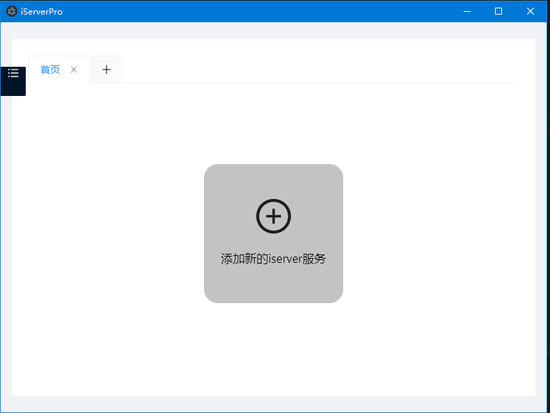

# About
  
此项目是 vue + element-ui 构建的后台管理系统，是后台项目node-elm 的管理系统，所有的数据都是从服务器实时获取的真实数据，具有真实的注册、登陆、管理数据、权限验证等功能。
# 说明

>如果对您对此项目有兴趣，可以点 "Star" 支持一下 谢谢！ ^_^  
>或者您可以 "follow" 一下，我会不断开源更多的有趣的项目  
>开发环境 Windows10 + Visual Code
>如有问题请直接在 Issues 中提，或者您发现问题并有非常好的解决方案，欢迎 PR 👍  

# 技术栈
react + webpack + electron

# 项目运行
```
npm install
npm run start
```

# 效果演示


# License
Apache2